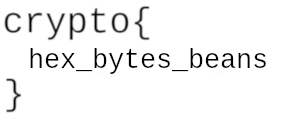

<h1>Adrien's Signs</h1>

```py
from random import randint

a = 288260533169915
p = 1007621497415251

FLAG = b'crypto{????????????????????}'


def encrypt_flag(flag):
    ciphertext = []
    plaintext = ''.join([bin(i)[2:].zfill(8) for i in flag])
    for b in plaintext:
        e = randint(1, p)
        n = pow(a, e, p)
        if b == '1':
            ciphertext.append(n)
        else:
            n = -n % p
            ciphertext.append(n)
    return ciphertext

print(encrypt_flag(FLAG))
```
Output
```txt
[67594220461269, 501237540280788, 718316769824518, 296304224247167, 48290626940198, 30829701196032, 521453693392074, 840985324383794, 770420008897119, 745131486581197, 729163531979577, 334563813238599, 289746215495432, 538664937794468, 894085795317163, 983410189487558, ...]
```
## Thought Process and Solution
This was the first challenging problem I reached while attempting the challenges. I had a little bit of Python experience, but not much, and especially not in the context of cryptography and bytes. So my first challenge was figuring out code actually does.

After checking a bit of documentation and experimenting, I realised that

> `plaintext = ''.join([bin(i)[2:].zfill(8) for i in flag])`

was taking each byte of the flag, converting into ascii, then concatenating the ascii to become `plaintext`. Then came understanding the next part:
```py
e = randint(1, p)
n = pow(a, e, p)
if b == '1':
    ciphertext.append(n)
else:
    n = -n % p
    ciphertext.append(n)
```
This was incredibly strange. For each bit, we got a random power of `a` (mod `p`), and we either got `n` or `p-n` depending on if the bit was '0' or '1'. It seemed like the goal was to somehow recover the bit given the power. However, this felt a bit impossible, since the exponenent is completely random.

I wondered why multiplying by -1 in the "else" case was significant (if this wasn't there, it would be impossible to recover the flag). Something that came up in the previous challenge was quadratic residues (squares) mod p, and I turned to my maths experience.

I knew that for primes 3 mod 4, there is no solution to $x^2 \equiv -1 \pmod p$. Conveniently, a quick check reveals that `p` is in fact 3 mod 4! This gave me motivation to check if `a` was a quadratic residue mod `p`. Using the test $a^{\frac{p-1}{2}} \equiv 1$, we get that `a` is indeed a quadratic residue.

This had significance, as it meant that any power of `a` was also a quadratic residue, and the negative of any power was not. This means we can now differentiate between '1' and '0's (1 if the element in data is a residue, 0 if not). My decrypt script first used this to recreate the binary string:
```py
a = 288260533169915
p = 1007621497415251
ans = ""
for x in data:
    if pow(x, (p-1)//2, p) == 1:
        ans += "1"
    else:
        ans += "0"
```
Then I converted the binary back to a string using a binary to string function I found online (also not too difficult to make myself).
```py
def binary_to_string(bins):
    str = ""
    for i in range(0, len(bins), 8):
        binc = bins[i:i + 8]
        num = int(binc, 2)
        str += chr(num)
    return str

print(binary_to_strings(ans))
```
Output:
>`crypto{p4tterns_1n_re5idu3s}`

## Reflection
To be honest, this problem felt pretty contrived in the sense that usually I wouldn't expect to have to look for special properties about `p` and `a`. That being said, I feel like I learnt a bit about using Python for computation, rather than finding calculators online. This was also one of the first concrete examples of maths being used in cryptography, which I found really nice. 

<div style="page-break-after: always"></div>

# Modular Binomials
`Rearrange the following equations to get the primes p,q`
```
N = p*q
c1 = (2*p + 3*q)**e1 mod N
c2 = (5*p + 7*q)**e2 mod N
```
Data:
```
N = 1490556225784271405793272412957500282540539350265086976711594260640860034338032786625898240244799256498846658830517427167465784435245454395884756819037244672354962775227444278918...
e1 = 12886657667389660800780796462970504910193928992888518978200029826975978624718627799215564700096007849924866627154987365059524315097631111242449314835868137
e2 = 12110586673991788415780355139635579057920926864887110308343229256046868242179445444897790171351302575188607117081580121488253540215781625598048021161675697
c1 = 1401072941870322823435246588304127061111373588983875343329547849576340905613673415561215693467398834488262954120498590965043381920529893987783731414508240352805588475207921915073...
c2 = 1438699713863797886074827898694509864850714286458411112420258036510379316581166698766485121023000937526739895797949406688029641801334500697765474230344103000849081623930639449216...
```
## Thought Process and Solution
We are given $pq$, and a linear combination of `p` and `q` powered to some known exponents mod `N`. I suspected that the actual numbers 2, 3, 5, 7 aren't too important, and they're just chosen for coprimeness.

#### Observation 1
Because we only ever deal with `p` and`q`, it sufficed to always consider numbers mod `N`. This meant that all my calculations can remain bounded and easily computed.

#### Observation 2
Another thing I noted was that taking `c1` and `c2` mod `p` or `q`, would simplify from a binomial to just a single term, such as $(2p)^{e1}$.

To relate the two equations together, I thought it would be a nice step to power each `c` value to the other exponenet. This would give me a common power of `e1e2` in both expressions.
 I knew that in general undoing an exponent is very difficult, but modulo a prime we can still do "division" in some sense. I realised I could use this by combining observation 2 with the power step.\
$c1^{e2} \equiv (2p)^{e1e2} \pmod q$\
$c2^{e1} \equiv (5p)^{e1e2} \pmod q$\
These expressions can all be calculated mod `N` and will still hold mod `q`. Then we can cross multiply and "divide out" by $p^{e1e2}$, and suddenly we have two numbers congruent mod q. In particular, this gives

$$c1^{e2}\times5^{e1e2} - c2^{e1}\times2^{e1e2} \equiv 0 \pmod q$$

Since all these values are known, we have a known number divisible by `q`. Now we can use a gcd algorithm to find the gcd of this value with `N`. Since it's divisible by `q` and we have been calculating mod `N`, the gcd will give us `q`. 
```py
from math import gcd
c1_powered = pow(c1, e2, N)
c2_powered = pow(c2, e1, N)

kq = c1_powered * pow(5, e1*e2, N) - c2_powered * pow(2, e1*e2, N)
print(gcd(kq, N))
```
Replacing the last 2 lines with corresponding versions for `p`:
```py
kp = c1_powered * pow(7, e1*e2, N) - c2_powered * pow(3, e1*e2, N)
print(gcd(kp, N))
```

Results:
```
q = 132760587806365301971479157072031448380135765794466787456948786731168095877956875295282661565488242190731593282663694728914945967253173047324353981530949360031535707374701705328450856944598803228299967009004598984671293494375599408764139743217465012770376728876547958852025425539298410751132782632817947101601
p = 112274000169258486390262064441991200608556376127408952701514962644340921899196091557519382763356534106376906489445103255177593594898966250176773605432765983897105047795619470659157057093771407309168345670541418772427807148039207489900810013783673957984006269120652134007689272484517805398390277308001719431273
```

## Reflection
Fun and challenging problem that wasn't technically demanding in terms of programming or cryptography but it did make use of my maths experience. It made me realise what sort of things were computationally feasible in Python. I never expected Python to be able to instantly power 200 digit numbers. I also felt that this was where I started getting used to using mathematic algorithms to compute actual answer beyond just "a solution exists".

<div style="page-break-after: always"></div>

# Passwords as Keys
`Just because a key looks like it is formed of random bytes, does not mean that it necessarily is. In this case the key has been derived from a simple password using a hashing function, which makes the ciphertext crackable.`
```py
from Crypto.Cipher import AES
import hashlib
import random


# /usr/share/dict/words from
# https://gist.githubusercontent.com/wchargin/8927565/raw/d9783627c731268fb2935a731a618aa8e95cf465/words
with open("/usr/share/dict/words") as f:
    words = [w.strip() for w in f.readlines()]
keyword = random.choice(words)

KEY = hashlib.md5(keyword.encode()).digest()
FLAG = ?


@chal.route('/passwords_as_keys/decrypt/<ciphertext>/<password_hash>/')
def decrypt(ciphertext, password_hash):
    ciphertext = bytes.fromhex(ciphertext)
    key = bytes.fromhex(password_hash)

    cipher = AES.new(key, AES.MODE_ECB)
    try:
        decrypted = cipher.decrypt(ciphertext)
    except ValueError as e:
        return {"error": str(e)}

    return {"plaintext": decrypted.hex()}


@chal.route('/passwords_as_keys/encrypt_flag/')
def encrypt_flag():
    cipher = AES.new(KEY, AES.MODE_ECB)
    encrypted = cipher.encrypt(FLAG.encode())

    return {"ciphertext": encrypted.hex()}
```
Output:
```py
{"ciphertext":"c92b7734070205bdf6c0087a751466ec13ae15e6f1bcdd3f3a535ec0f4bbae66"}
```
## Thought Process and Solution
This was the first challenge I came across involving actual AES encryption. There were a lot of new libaries and functions in this challenge that I wasn't used to playing around with yet, such as hashlib.md5.digest, AES.new, decrypt and encrypt. However, it wasn't too hard to get the gist of it. We were using the hash of a random word in a dictionary to encrypt the flag.

The idea then was to brute force all the possible dictionaries. First I had to figure out how to check a single password. I copied their decode script, but it took a while for me to figure out how to pass in the parameters properly as I now had a mixture of bytes, ascii strings and hex strings floating around, and wasn't sure how to properly convert between them.

My first few attempts were complicated and involved converting from ascii bytes to hex bytes using hexlify then slicing of the `b''` characters, then I realised I could convert directly between them using decode. Returning to this challenge at the end of the term, I realised I could further simplify using the .hex() function to convert directly to a hex string.

```py
ciphertext = "c92b7734070205bdf6c0087a751466ec13ae15e6f1bcdd3f3a535ec0f4bbae66"
w = "password"
keyword = w.strip()
hash = hashlib.md5(keyword.encode()).digest()
plain = bytes.fromhex(decrypt(ciphertext, hash.hex())['plaintext'])
```

Now it was just a matter of trying this for each password in the textfile. To check when I got the right key, I checked when the first 7 bytes of the plaintext was b'crypto{'.

```py
ciphertext = "c92b7734070205bdf6c0087a751466ec13ae15e6f1bcdd3f3a535ec0f4bbae66"
with open("words.txt") as f:
    for w in f.readlines():
        keyword = w.strip()
        hash = hashlib.md5(keyword.encode()).digest()
        plain = bytes.fromhex(decrypt(ciphertext, hash.hex())['plaintext'])
        if (plain[:7] == bytes("crypto{", "utf-8")):
            print(plain)
            print(keyword)
```
Output:
```
b'crypto{k3y5__r__n07__p455w0rdz?}'
bluebell
```

## Reflection
Reading files and automating tasks have always been particularly daunting tasks for me in terms of coding, mainly because it's not something I do often. This made completing this task feel a lot more significant to me despite how straight forward it was conceptually. After this challenge, I got much better at converting between different formats, and also felt much more comfortable with using code to automate tasks such as brute forcing a dictionary. This was one of the challenges that helped my Python skills a lot as well as my cryptography.

<div style="page-break-after: always"></div>

# ECB Oracle
`ECB is the most simple mode, with each plaintext block encrypted entirely independently. In this case, your input is prepended to the secret flag and encrypted and that's it. We don't even provide a decrypt function. Perhaps you don't need a padding oracle when you have an "ECB oracle"?`
```py
@chal.route('/ecb_oracle/encrypt/<plaintext>/')
def encrypt(plaintext):
    plaintext = bytes.fromhex(plaintext)

    padded = pad(plaintext + FLAG.encode(), 16)
    cipher = AES.new(KEY, AES.MODE_ECB)
    try:
        encrypted = cipher.encrypt(padded)
    except ValueError as e:
        return {"error": str(e)}

    return {"ciphertext": encrypted.hex()}
```
## Thought Process and Solution
This was one of the first serious AES challenges I attempted, so I had no clue what sort of vulnerabilities such an implementation could have. However, the problem did give a hint that it would involve an "ECB oracle", so I searched it up to see what it was.

Turns out this was a pretty commmon trick when arbitrary plaintext can be prepended to a flag. It exploits the fact that ECB encrypts the the same plaintext block to the same ciphertext every time. If we prepend 15 bytes of plaintext, the first block contains 15 known bytes plus the first byte of the ciphertext. This means there are 255 possible values for the ciphertext, so if we prepend another block of the same 15 bytes + variable_byte, we can cycle through all 255 values for this last byte, and when we get two matching 16 byte ciphertexts we would have found the first byte of the flag.

Plaintext: `b'a'*15 + var + b'a'*15`\
First two blocks: `b'a'*15 + var, b'a'*15 + flag[0]`

We can then repeat this process to leak the next byte:

Plaintext: `b'a'*14 + flag[0] + var + b'a'*14`\
First two blocks: `b'a'*14 + flag[0] + var, b'a'*14 + flag[0] + flag[1]`

This process lets us leak the entire flag in linear time, which is quite amazing. Now all I had to do was implement this.

The implementation process was quite a trek. The first barrier was the fact that I actually had to automate the request process, as bruteforcing the entire flag would take far too long. Here I consulted some friends to help me with requests, and they showed me how to set up the script nicely.

```py
from requests import Session

s = Session()

def encrypt(data):
    url = "https://aes.cryptohack.org/ecb_oracle/encrypt/" + data.hex() + "/"
    return bytes.fromhex(s.get(url).json()["ciphertext"])
```
First I figured out how many bytes were in the original flag. I prepended an increasing number of bytes until I got an extra block in the ciphertext. This meant I had completely filled a block, and a new block of padding was added.
```
input: 010203040506
output: {"ciphertext":"1d5baa452711e6c4d45eb03db20421bb23167185f5c0719c529f094b6f0d3fc0"}
input: 01020304050607
output: {"ciphertext":"5bf745bca22b3ec7cb80f786cfe04df3973e3df6f87f32614f5ddbe5e6cabde7c1511dbc19f27396337d05c2dc9d182f"}
```
This took 7 bytes, which meant the flag is 25 bytes long. This meant I should make my extra plaintext 2 blocks long to fit the whole flag. I first created the brute forcer for the first byte. I knew that the first byte of the flag would be `'c'`, so this was a nice sanity check to make sure this part was working.

```py
x = b'a'*31
subs = 0
cipher = encrypt(x + bytes([subs]) + x)
while (cipher[:32] != cipher[32:64]):
    subs += 1
    cipher = encrypt(x + bytes([subs]) + x)
```

Once the brute forcer was done, I set up the loop to do this 25 times, and after each try to adjust the amount of plaintext I put. To ensure I didn't lose anything if the code crashed, I appended each character to a file. I also printed each character as it was found just so I could see that the code was working.

```py
f = open("symmetric/ecb_oracle/flag.txt", "a")
flag = b""
for i in range(25):
    x = b'a' * (31 - i)
    subs = 0
    cipher = encrypt(x + flag + bytes([subs]) + x)
    while (cipher[:32] != cipher[32:64]):
        subs += 1
        cipher = encrypt(x + flag + bytes([subs]) + x)
    print("next char: " + str(subs))
    flag += bytes([subs])
    f.write(chr(subs))
print(flag)
```

Now all that was left was to wait. It took about 20-30 seconds per character, so the whole process took a bit under 10 minutes to complete, after which I finally found the flag:\
`b'crypto{p3n6u1n5_h473_3cb}\x01'`

## Reflection
This problem was the most difficult challenge I completed up to this point, both in terms of cryptography concepts and implementation. While I knew roughly what to do after reading about the ECB oracle, implementation took a very long time. The final script is relatively short and clean, however the process to getting there was not at all. I had struggles converting between the data formats, and also figuring out how to construct the plaintext string from the flag.

Overall, this challenge taught me a lot about implementing cryptography scripts. I learnt how to use sessions to make requests, and ways to set up requests to make converting between data formats as painless as possible. On top of that, this was the first real "vulnerability" I learnt about AES, and one I thought was particularly cool. These reasons made this challenge one of the most rewarding ones out of the whole term.

<div style="page-break-after: always"></div>

# Lazy CBC
`I'm just a lazy dev and want my CBC encryption to work. What's all this talk about initialisations vectors? Doesn't sound important.`

```py
from Crypto.Cipher import AES


KEY = ?
FLAG = ?

@chal.route('/lazy_cbc/encrypt/<plaintext>/')
def encrypt(plaintext):
    plaintext = bytes.fromhex(plaintext)
    if len(plaintext) % 16 != 0:
        return {"error": "Data length must be multiple of 16"}

    cipher = AES.new(KEY, AES.MODE_CBC, KEY)
    encrypted = cipher.encrypt(plaintext)

    return {"ciphertext": encrypted.hex()}


@chal.route('/lazy_cbc/get_flag/<key>/')
def get_flag(key):
    key = bytes.fromhex(key)

    if key == KEY:
        return {"plaintext": FLAG.encode().hex()}
    else:
        return {"error": "invalid key"}


@chal.route('/lazy_cbc/receive/<ciphertext>/')
def receive(ciphertext):
    ciphertext = bytes.fromhex(ciphertext)
    if len(ciphertext) % 16 != 0:
        return {"error": "Data length must be multiple of 16"}

    cipher = AES.new(KEY, AES.MODE_CBC, KEY)
    decrypted = cipher.decrypt(ciphertext)

    try:
        decrypted.decode() # ensure plaintext is valid ascii
    except UnicodeDecodeError:
        return {"error": "Invalid plaintext: " + decrypted.hex()}

    return {"success": "Your message has been received"}
```
## Solution and Thought Process
When interpreting the problem, I looked at how they implemented CBC here and tried to see what "iv doesn't sound important" meant. I immediately noticed in the encrypt function that AES was setup by
```
AES.new(KEY, AES.MODE_CBC, KEY)
```
rather than
```
AES.new(KEY, AES.MODE_CBC, iv)
```
So the issue is that they have used the key as the iv. This means we get access to the key xored with anything of our choice. Another point I noticed was that in the receive route, we would not be able to see the decrypted plaintext if it's ascii. However, if it's not in ascii, it would show the whole thing. This suggested I try encode characters outside the usual ascii range.

I could do the following things:
Encrypt (1st block) key ^ arbitrary plaintext -> ciphertext\
Encrypt (2nd block) prev ciphertext ^ arbitrary plaintext -> another ciphertext\
Decrypt arbitrary ciphertext -> decrypted ^ key

If I could find what a known plaintext encrypts to, then I could decrypt its ciphertext to plaintext ^ key, then xor again with the original plaintext. Conveniently, this could be done using the second block.

First I set up the request
```py
from requests import Session

s = Session()

def encrypt(plain):
    url = "https://aes.cryptohack.org/lazy_cbc/encrypt/" + plain.hex() + "/"
    return bytes.fromhex(s.get(url).json()["ciphertext"])

def decrypt(cipher):
    url = "https://aes.cryptohack.org/lazy_cbc/receive/" + cipher.hex() + "/"
    return bytes.fromhex(s.get(url).json()["error"][19:])

def get_flag(key):
    url = "https://aes.cryptohack.org/lazy_cbc/get_flag/" + key.hex() + "/"
    return bytes.fromhex(s.get(url).json()["plaintext"])
```
First I encrypt 16 bytes of `\x01`, which is first xored with the key.
```py
p1 = b'\x01' * 16
c1 = encrypt(p1)
```
This gives me a known ciphertext, which acts as the IV in the next block.
To undo the xor with IV, I xor the next plaintext (`'\xff'*16`) with the IV.
```py
p2 = bytes(x ^ 255 for x in c1)
c2 = encrypt(p1 + p2)[16:32]
```
We now know `'\xff' * 16` encrypts to c2, so if we decrypt c2 and xor it back we will get the flag
```py
d = decrypt(c2)
key = bytes(x ^ 255 for x in d)
print(get_flag(key))
```
```
b'crypto{50m3_p30pl3_d0n7_7h1nk_IV_15_1mp0r74n7_?}'
```

## Reflection
I attempted this problem near the end of the term, and I was pleasantly surprised at how quickly I was able to figure it out. When I first saw CBC problems, I had to keep staring at the diagram, and had to spend time understanding how the encryption and decrytion actually worked. For this problem, I was able to think through the process without referring back to the diagram, and was able to roughly figure out the solution in my head without having to write working.

I could have done this problem completely manually, but I decided to challenge myself my writing request functions for practice. Now that I was much more familiar with converting between different data formats, this process was a lot faster than previous attmepts, and I could feel my improvement.

<div style="page-break-after: always"></div>

# Bean Counter
`I've struggled to get PyCrypto's counter mode doing what I want, so I've turned ECB mode into CTR myself. My counter can go both upwards and downwards to throw off cryptanalysts! There's no chance they'll be able to read my picture.`
```py
from Crypto.Cipher import AES
KEY = ?

class StepUpCounter(object):
    def __init__(self, step_up=False):
        self.value = os.urandom(16).hex()
        self.step = 1
        self.stup = step_up

    def increment(self):
        if self.stup:
            self.newIV = hex(int(self.value, 16) + self.step)
        else:
            self.newIV = hex(int(self.value, 16) - self.stup)
        self.value = self.newIV[2:len(self.newIV)]
        return bytes.fromhex(self.value.zfill(32))

    def __repr__(self):
        self.increment()
        return self.value

@chal.route('/bean_counter/encrypt/')
def encrypt():
    cipher = AES.new(KEY, AES.MODE_ECB)
    ctr = StepUpCounter()

    out = []
    with open("challenge_files/bean_flag.png", 'rb') as f:
        block = f.read(16)
        while block:
            keystream = cipher.encrypt(ctr.increment())
            xored = [a^b for a, b in zip(block, keystream)]
            out.append(bytes(xored).hex())
            block = f.read(16)
```
# Thought Process and Solution
The first thing I did was try to figure out what the counter was actually doing. The easiest way to do this was just copy the code and print out `ctr.increment()` after each stage to see what it was actually doing.

It turns out that because of how it has been initialised, `increment` doesn't change its value at all. This meant that instead of actually encrypting the image using AES, it was just xoring the bytes with a repeating 16 bytes key. Now that I had greatly simplified the problem, it sufficed to figure out this key.

At first I tried simply throwing the bytes into an online hex to png converter. I was hoping that since every byte was being xored by the same key, pixels of the same colour would go to the same encrypted colour, much like the issue with ECB encryption. Unfortunately, the decoder failed to give an image. After a bit of googling, I found that the first 8 bytes of a png were always the same header bytes\
`137, 80, 78, 71, 13, 10, 26, 10`\
This nicely gave me the first 8 bytes of the key by xoring with the first 8 encrypted bytes.\
`154, 21, 80, 43, 234, 233, 136, 43`\
Now I had to figure how to get the remaining 8 bytes.

This sent me on an unfortunately long search looking at how pngs were encoded. I discovered that it was divided into chunks, each one having a chunk name, data length, and a crc check. However I was unable to figure out how I would get 8 more bytes out of this. I could potentially use the chunk name which was another 4 bytes, but my searches online didn't tell me much specific information on what the next 4 bytes would be.

After a few searches, I decided to look at google images to see if there were any screenshots of png header files. After looking at two different images, I noticed that not only were the first 8 bytes the same (which I already knew), the next 8 were as well!\
`[137, 80, 78, 71, 13, 10, 26, 10, 0, 0, 0, 13, 73, 72, 68, 82]` -> `b'\x89PNG\r\n\x1a\n\x00\x00\x00\rIHDR'`

It turns out that the header chunk is 12 bytes long instead of the 8 bytes I initially thought it was, and since the first chunk afterwards is always an IHDR chunk, we have the first 16 bytes are fixed. Xoring with my first 16 bytes of the encrypted bytes gave me the key.
```py
fr = open("symmetric/bean_counter/image.txt", "r")
b = bytes.fromhex(fr.read(32))

header = [137, 80, 78, 71, 13, 10, 26, 10, 0, 0, 0, 13, 73, 72, 68, 82]

key = [x^y for x, y in zip(b, header)]
```
Once I got the key, all I had to do now was decrypt each 16 byte block and write the bytes to a file.
```py
fw = open("symmetric/bean_counter/image_as_bytes.png", "wb")
while b:
    for x,y in zip(b, key):
        fw.write(long_to_bytes(x^y))
    b = bytes.fromhex(fr.read(32))
```
Opening the image file revealed the flag\


## Reflection
While the premise of the challenge was straightforward, there were many technical parts of the challenge I wasn't familiar with previously, which made this challenge take longer than expected. I spent close to an hour looking at how pngs were encoded in hex and the different chunks that were available. I initially thought about trying to use the other parts of the chunks such as using the different chunk types (IHDR, IDAT, IEND) to get the xor on the last 8 bytes of the key, before realising that it wasn't necessary.

This was also my first time writing bytes to an image, and while it wasn't too hard to figure out, it did slightly add to the complexity of the problem as it was one more thing I had to actively think about. I also made the mistake of trying to read the input as bytes instead of a hex string and then converting to bytes, which also added to the time spent on this problem.

On the bright side, it was nice that I was somewhat able to quickly figure out the issue in terms of cryptography, and had the intuition to reach the right solution from there. This problem taught me a lot about the format of png files, and I learnt that you could perform encryption with images the same way you could with any other string of bytes.

<div style="page-break-after: always"></div>

# Square Eyes
```
It was taking forever to get a 2048 bit prime, so I just generated one and used it twice.
n = 5358608080440095500291771357081680162014513431473135653710144590277434917394228854430847057207314097137755279937196825836691648738068420432884398280717899706947590808421622539552...
e = 65537
ct = 2225028859741824295009483898405634152915347268913545739073295125564396328109219279052204867278074366680359293024427542259527866024922504480203412177336464729822862223388605660761...
```
## Thought Process and Solution
I know that $\Phi(p^2) = p(p-1)$, and given that `n` is a perfect square it's not too hard to square root it using Sage, which seems to be very powerful at taking roots. It's interesting that normal Python doesn't seem to be strong enough to do it.
Square rooting gives:
```py
p = 2314866752199809772085716882779077133766248371634843547736056740935502616916593444694980966459552377085389720310375910698398511326404905741690819116672000850327595162573897566601...
```
From here, we can easily find `d` and decrypt the ciphertext back to plaintext
```py
d = pow(e, -1, p * (p-1))
d = 4456417233138937166065007770801574894643896204519283954623556320916292099161353971848642097730598596766697835152921839549829942340524331581450148152859723327704419516172600107927...
pt = pow(ct, d, p*p)
pt = 912327745903138317426723037632596080882852291533603076406890007888287805926165236318117298828527463941218685
```
Finally, converting long to bytes gives us the flag:
```py
from Crypto.Util.number import long_to_bytes
long_to_bytes(pt)
b'crypto{squar3_r00t_i5_f4st3r_th4n_f4ct0r1ng!}'
```

## Reflection
This was a much shorter problem than some of the others I've done full writeups for, primarily because the main idea behind the solution was only mathematically challenging, but really simple to implement once I found the idea. I've put this here because it served as inspiration for one of the challenges I made. Cool demonstration on not using just a single prime, but I think it can be extended to show that any pair of related primes is likely bad.

<div style="page-break-after: always"></div>

# Modulus Inutilis
`My primes should be more than large enough now!`
```py
from Crypto.Util.number import getPrime, inverse, bytes_to_long, long_to_bytes

e = 3
d = -1

while d == -1:
    p = getPrime(1024)
    q = getPrime(1024)
    phi = (p - 1) * (q - 1)
    d = inverse(e, phi)

n = p * q

flag = b"XXXXXXXXXXXXXXXXXXXXXXX"
pt = bytes_to_long(flag)
ct = pow(pt, e, n)

print(f"n = {n}")
print(f"e = {e}")
print(f"ct = {ct}")
```
Output:
```
n = 17258212916191948536348548470938004244269544560039009244721959293554822498047075403658429865201816363311805874117705688359853941515579440852166618074161313773416434156467811969628473425365608002907061241714688204565170146117869742910273064909154666642642308154422770994836108669814632309362483307560217924183202838588431342622551598499747369771295105890359290073146330677383341121242366368309126850094371525078749496850520075015636716490087482193603562501577348571256210991732071282478547626856068209192987351212490642903450263288650415552403935705444809043563866466823492258216747445926536608548665086042098252335883
e = 3
ct = 243251053617903760309941844835411292373350655973075480264001352919865180151222189820473358411037759381328642957324889519192337152355302808400638052620580409813222660643570085177957
```
## Thought Process and Solution
This challenge had a very simplistic setup. All it had was a standard RSA implementation using `e = 3`, and the standard output of `n, e, ct`. This is always nice from a problem solver's perspective: There's nothing for me to change, and RSA hasn't been broken as of yet, so the problem must either lie in their implementation or the outputs, as it physically cannot be anywhere else.

Looking at the implementation, it seems correct to me and the same as how it's implemented in other challenges. This prompted me to look at the outputs.

The first thing I noticed was `e = 3`. I hadn't seen such small `e` used before, so I searched online to see if cube rooting mod `n` was computable the same way square roots were. After some searches, it seemed that it wasn't possible, and in factor square rooting was only easy mod primes, and would be hard mod `n` anyways.

I then turned to the remaining outputs, `n` and `ct`. Something that I then noticed was that `ct` was way smaller than `n`, and my maths intuition told me this was suspicious. Since `n` is prime, chances are a power mod `n` will have a similar number of digits as `n` (unlikely for the power to just be over `n`). That is, unless the power never went above `n`. In this case, the `ct` was tiny, which made me suspect that it was just straight up the cube of the message without any modulo arithmetic occurring.

I first tried looking for ways to cube root large numbers online, however amusingly I was recommended videos teaching how to cube root "large numbers" such as 195112, which was far from sufficient. I tried doing a binary search in Python, however it ended up getting stuck in an infinite loop due to float precision issues (upon revisiting, I found out that I should have used `(a+b)//2` rather than `int((a+b)/2)`, as this will immediately convert to an int with no loss in precision). Luckily, I remembered that Sage has some insane computing capabilities, and tried there.

As expected, putting `ct` into Sage and cube rooting gave me an integer:
```
624239975241694158443315202759206900318542905782320965248893
```
A quick conversion using the long_to_bytes function gave me the flag:
```
b'crypto{N33d_m04R_p4dd1ng}'
```
## Reflection
Overall a pretty simple problem with not that much technical skill beyond a little bit of maths experience. That being said, it was quite an interesting vulnerability, where the chosen primes might accidentally be too large, and in the case of a short message the choice of `n` would not be able to serve its purpose. Interestingly enough the choice of `e = 3` for the public encryption key is actually not insecure, which I thought was surprising.

The issue with the binary search was also a good lesson learnt, as now I know how to properly binary search on integers in Python, and not need to rely purely on functions existing in Sage or helper libraries.

<div style="page-break-after: always"></div>

# Static Client 2
`You've just finished eavesdropping on a conversation between Alice and Bob. Now you have a chance to talk to Bob. What are you going to say?`

`Bob got a bit more careful with the way he verifies parameters. He's still insisting on using the p and g values provided by his partner. Wonder if he missed anything?`

```
Intercepted from Alice: {"p": "0xffffffffffffffffc90fdaa22168c234c4c6628b80dc1cd129024e088a67cc74020bbea63b139b22514a08798e3404ddef9519b3cd3a431b302b0a6df25f14374fe1356d6d51c245e485b576625e7ec6f44c42e9a637ed6b0bff5cb6f406b7edee386bfb5a899fa5ae9f24117c4b1fe649286651ece45b3dc2007cb8a163bf0598da48361c55d39a69163fa8fd24cf5f83655d23dca3ad961c62f356208552bb9ed529077096966d670c354e4abc9804f1746c08ca237327ffffffffffffffff", "g": "0x02", "A": "0x8c1642320420612f91134c9bc2ba6b570b534a2eb1e9cdae076cd6ce902ad03fd053876fc778f2e3ce427c2abcedc958f8dfcb3c5246296ebdd48f8e3c9a3b275b2b02904a1491c563458e9857dbcf9e9152823a47f92ea4f2be7869cd368c6cb57a63f0caa0808480d9bdc23955174f8d1237c83f7e01771e5c4d93081d64de855fcebfaf67822efe13b0b3d3916617a9ea8039be4490a3da8c1981e438085f4745d6a8438c48eccabb5bbf18a25272bcd82099956f325b7fcd91b42c868893"}
Intercepted from Bob: {"B": "0xd0d69585c6586c3b1a23e04245826be6db4aed1c9bc70f7110a30165ca878d31434aa357c2bd26d3c398284a17319504e1aeead141234afeb57dfef11417fdec44b21cea83920f300f4e0c3fb573a895371b24652c5e6ea0539b7719f0f966ac7adb9a292cc49f4d8b39560e02fa82aab3c273cc7df512a80e2de6f0e8840c00554f09460eaa2e221173a9ca13182d4e1342b1e54965e16ca5fc23b1aae80aedc7fb80e1aa9be8b0274812676e8e570e1abf65eea0c49f18794a5afba975c7c7"}
Bob connects to you, send him some parameters:
```

## Thought Process and Solution
The idea behind this solution was created in collaboration with Cyril Subramanian, however implementations were written independently.

 Compared to Static Client 1 (mini writeup below), the difference here was that you were no longer allowed to change the value of `g`. Connecting to the challenge a few time showed that Bob used the same secret `b` value every time (`B = g**b`). While the problem statement implied `p` was also fixed, it turns out from a few tests that larger values of `p` were allowed too.

What made this problem hard was the limited amount of things we could change. Technically we could change the values of `p` and `A`, but the value of `A` does nothing at all, since it only gets used by Bob to create the shared secret. This meant that in practice the only thing we could change is the prime.

While this made the problem seem even harder, at the same time it did mean we had less avenues to explore. Realistically, all we could do is find the remainder of $2^b$ mod arbitrary large primes, and somehow from this we had to extract `b`.

For Static Client 1, I initially had an idea of choosing small values of `p` and solving discrete log to find $b \pmod {p-1}$ for a lot of small primes, and then using chinese remainder theorem to find $b$. This turned out to be both unnecessary and a pain to implement, however this idea inspired Cyril to find a way to use larger primes to do something similar. He realised that the same result could be achieved by finding `b*p mod p * smallmod`, and `p * smallmod` would be a valid input.

The easiest way to get this mod was if `p * smallmod + 1` was prime, in which case Fermat's Little Theorem could be used. Since this expression would always be odd, an adjustment was made to find prime `2pq + 1`, where `q` is prime.

The first step was to generate a list of primes `q` such that `2pq+1` was also prime. We need enough so that the product of these `q`s is big enough that Chinese Remainder Theorem reveals the actual value for `b`.
```py
primes = []
i = 3
while len(primes) < 100:
    if isPrime(2*i*p+1):
        primes.append(i)
    i = nextprime(i, 1)

f = open("./asymmetric/diffie_hellman/primes.txt", "w")
f.write(str(primes))
```
Output
```
[3319, 7297, 10891, 25117, 31237, 54547, 54631, 55147, 59359, 70237, 84499, 94597, 113041, 139609, 141769, 149161, 151429, 169009, 170047, 178939, 179899, 181459, 189901, 194167, 194899, 201511, 212239, 216571, 236701, 260179, 260959, 283501, 291439, 311821, 319237, 327661, 339991, 347959, 359101, 370441, 381739, 384259, 388237, 397351, 398011, 400009, 412891, 423751, 435139, 435541, 457117, 492901, 523759, 528691, 533077, 544501, 547741, 553897, 564391, 567631, 570601, 571279, 638767, 650071, 659539, 662047, 668671, 669181, 674239, 691189, 692161, 699469, 702451, 707677, 719119, 723529, 775507, 780841, 804511, 805867, 806521, 811411, 812167, 822589, 834181, 860887, 872161, 891799, 898327, 898981, 936379, 938341, 939109, 944149, 946819, 959659, 973759, 1005679, 1006987, 1016737]
```
Surprisingly, the values for `q` weren't large at all, which meant that discrete log was entirely brute forceable.\
The next step was sending Bob all the primes and getting the corresponding $2^b$ back, decode to a hex string, convert to an integer and power it to 2p mod 2pq+1.

```py
f = open("./asymmetric/diffie_hellman/primes.txt", "a")
for x in primes:
    conn = remote("socket.cryptohack.org", 13378)
    conn.recvline()
    conn.recvline()
    conn.recvline()
    conn.send(b'{"p": "' + bytes(hex(2*x*p+1), "utf-8") + b'", "g": "0x02", "A": "0x03"}')
    f.write(str(pow(int(conn.recvline()[71:-3].decode(), 0), 2*p, 2*x*p+1)) + "\n")
    conn.close()
```
Now I had 100 pairs of residues and modulus for $2^{2pb} \equiv (2^{2p})^b$. For each one, we calculate the discrete logarithm with base $2^{2p}$. An interesting thing to note is that despite $2pq+1$ being huge, because $2^{2pq} \equiv 1 \pmod{2pq+1}$ by Fermat's, it means $2^{2p}$ has order `q` (min power such that the power is 1). This means discrete log only needs to check `q` different values, which is very easy (and the motivation for why we constructed primes of the form `2pq`).
```py
f = open("./asymmetric/diffie_hellman/primes.txt", "r")
f.readline()
residues = []
mods = []
for i in range(100):
    power = int(f.readline())
    base = pow(2, 2*p, 2*p*primes[i]+1)
    residues.append(discrete_log(2*p*primes[i]+1, power, base, primes[i]))
    mods.append(primes[i])
```
Finally, using Chinese Remainder Theorem from sympy, I was able to find `b`.

```py
from sympy.ntheory.modular import crt
print(crt(mods, residues))

b = 191957294369151232578310372016783416367741129270937850253549885998999354402638014391950104958458967531764399346553654389578085480844229300001429721020022706977964376312170481028197673397878115212606...
```
Now that I had `b`, `A` and `p`, I was able to find the shared secret `pow(A, b, p)`, which then I substituted into the provided decryption script along with the IV and ciphertext.
```
crypto{uns4f3_pr1m3_sm4ll_oRd3r}
```

## Reflection
This was by far the most insane problem I had encountered throughout my entire project. It required a little playing around with the challenge, some mathematical knowledge and experience to construct the primes and think of using CRT, and then probably the longest script overall to implement each step. I felt extremely proud when I solved this challenge, and it felt like all the work throughout the term had come together to create this solution.

I think even though mathematically I always had the knowledge required to solve this problem, I would have definitely struggled with implementation and figuring out what libraries to use. After solving this challenge and implementing the scripts independently, I can confidently say that I have come quite far from where I began.

Something else I learnt from this problem was also to think less about the mathematical rigour of a solution and just try it. In this instance, there's no guarantee that any primes of the form `2pq+1` exist at all, or at least I haven't proved it. And yet there were more than enough to get the job done. This made realise there was a difference between mathematical theory and what happens in practice, so I shouldn't always think too hard about guaranteeing a construction would work, and instead focus more on what the constructions actually are.


<script type="text/javascript" src="http://cdn.mathjax.org/mathjax/latest/MathJax.js?config=TeX-AMS-MML_HTMLorMML"></script>
<script type="text/x-mathjax-config">
    MathJax.Hub.Config({ tex2jax: {inlineMath: [['$', '$']]}, messageStyle: "none" });
</script>